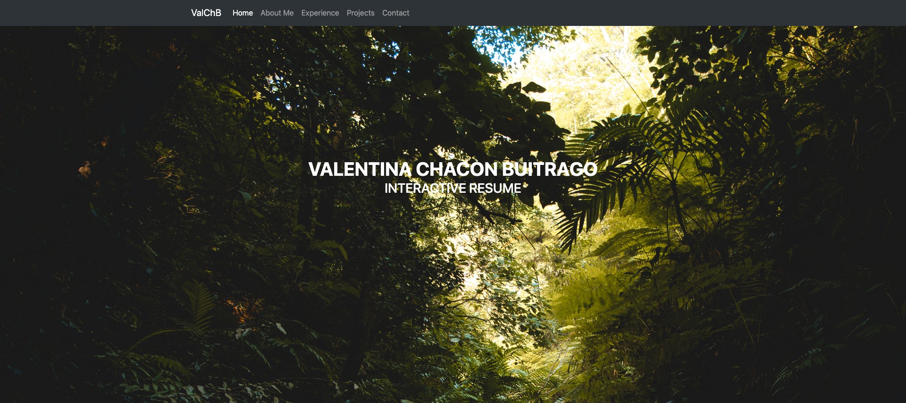

# Interactive Resume Project

### Author
[Valentina Chacon Buitrago](https://github.com/ValentinaChaconBuitrago)
### Objectives
  * Develop an interactive resume containing valuable information about my work, projects and interest.
  * Use Web Development tools to create a static webpage.
  
### Technologies involved
  * HTML
  * CSS/Bootstrap
  * JavaScript
  * Mail
  
### Project Deployment
  To deploy this project simply click on the index.html file available or run a [local server](https://youtu.be/Q5bbPEAOwYs?t=1284) on your computer.
### License
[MIT License](https://github.com/ValentinaChaconBuitrago/Interactive-Resume/blob/master/LICENSE)
